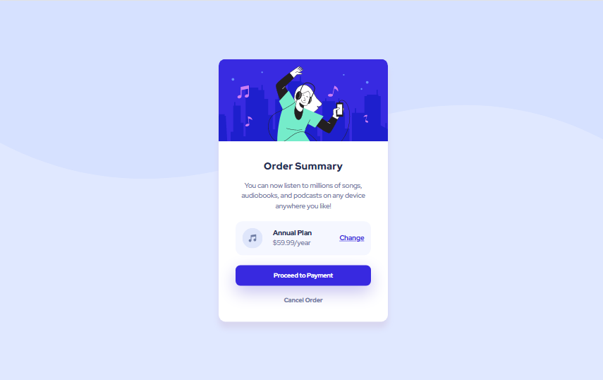

# Frontend Mentor - Order summary card solution

This is a solution to the [Order summary card challenge on Frontend Mentor](https://www.frontendmentor.io/challenges/order-summary-component-QlPmajDUj). Frontend Mentor challenges help you improve your coding skills by building realistic projects. 

## Table of contents

- [Overview](#overview)
  - [The challenge](#the-challenge)
  - [Screenshot](#screenshot)
  - [Links](#links)
- [My process](#my-process)
  - [Built with](#built-with)
  - [What I learned](#what-i-learned)
  - [Useful resources](#useful-resources)
- [Author](#author)

**Note: Delete this note and update the table of contents based on what sections you keep.**

## Overview

### The challenge

Users should be able to:

- See hover states for interactive elements

### Screenshot

### Links

- Solution URL: [Solution URL](https://www.frontendmentor.io/solutions/order-summary-component-6YTvf7mCCB)
- Live Site URL: [Live Site](https://order-summary-card-frontendmentor.vercel.app/)
- Github Repository URL: [Github](https://github.com/juliansyahrifqi/order-summary-card-frontendmentor)

## My process

### Built with

- Semantic HTML5 markup
- CSS custom properties
- Flexbox
- CSS Grid
- Mobile-first workflow

### What I learned

Using CSS Variablem, use CSS Reset by Josh Comeau and Create Box Shadow Effect

### Useful resources

- [CSS Reset by Josh Comeau](https://www.joshwcomeau.com/css/custom-css-reset/) - This helped me for resetting CSS

## Author

- Website - [Rifqi Pratama Juliansyah](https://www.rifqipratamaj.me/)
- Frontend Mentor - [@juliansyahrifqi](https://www.frontendmentor.io/profile/juliansyahrifqi)
- Twitter - [@juliansyahrifq1](https://www.twitter.com/juliansyahrifq1)

